# Arcron: high-level design

How Arcron works end to end, drawn from the code. Where this page and the code
disagree, the code is right and this page is stale. Figures that change (fees
in the console, upkeep counts, runway) are deliberately left to the files that
own them and linked rather than copied, because copied figures are the most
common defect in this repository's history (see `tests/test_book.py`).

Status when written (2026-09-26): the keeper is live on TestNet (app
`769891898`, demo target Pulse `769891902`), unfrozen. MainNet is planned, not
created; the plan is [`design/mainnet-rollout.md`](design/mainnet-rollout.md).
For what is live right now, [`status.md`](status.md) and
[`releases.md`](releases.md) are the pages to trust.

## 1. Purpose

Algorand contracts cannot wake themselves: anything time-based (a draw, a
billing period, a vesting step) needs somebody to send a transaction at the
right round. Arcron is a permissionless keeper registry for that. A creator
registers an **upkeep** ("call this app with these arguments every N rounds,
paying R microAlgos per run") and escrows ALGO in the contract; any account,
a **keeper**, may execute a due upkeep; the contract makes the registered call
as an inner transaction and pays the keeper from the escrow in the same
transaction. No allowlist, no stake, no token, no protocol rake. The people it
serves are contract authors who need a schedule without running a server,
and keeper operators who earn fees for sending the transactions. Why it
exists, and what would prove it wrong, is [`why.md`](why.md).

## 2. Context

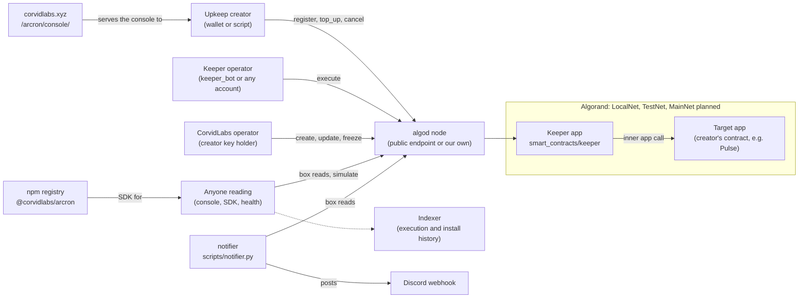

Everything talks to the chain through an algod node. The public TestNet
endpoints are the default ([`scripts/network.py`](../scripts/network.py)
loads `.env.<network>` and checks the node's genesis id); a node of our own is
the plan for MainNet ([`hosting.md`](hosting.md)). The indexer is optional and
read-only: `health`, `keeper-preview` and `clock` use it for history. Discord
is the only outbound integration, and only the notifier uses it.

## 3. Components

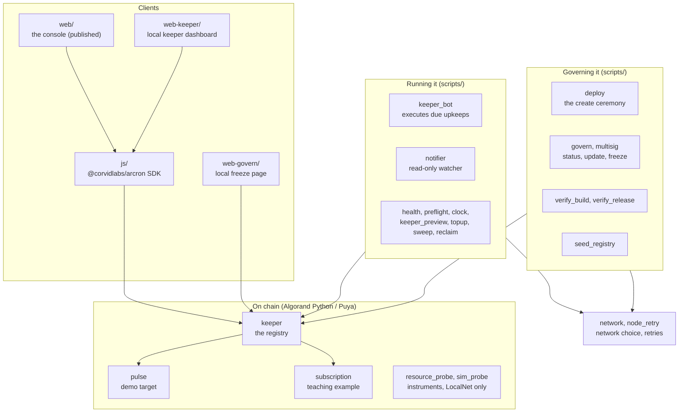

| Component | Owns | Code |
|---|---|---|
| Keeper contract | The registry: upkeep boxes, escrow, scheduling, keeper pay, `update` and `freeze` | [`smart_contracts/keeper/contract.py`](../smart_contracts/keeper/contract.py), spec [`specs/keeper/`](../specs/keeper/) |
| Pulse | A heartbeat counter whose `tick` cannot fail; the target the uptime clock reads | [`smart_contracts/pulse/contract.py`](../smart_contracts/pulse/contract.py) |
| Subscription | Recurring billing as pull payment, the integration shape the docs recommend; LocalNet only | [`smart_contracts/subscription/contract.py`](../smart_contracts/subscription/contract.py) |
| Probes | Instruments that pin what an inner call may reach and where `simulate` stops predicting `execute` | [`smart_contracts/resource_probe/`](../smart_contracts/resource_probe/), [`smart_contracts/sim_probe/`](../smart_contracts/sim_probe/) |
| Keeper bot | Scans boxes, simulates, executes what is due, backs off failing targets | [`scripts/keeper_bot.py`](../scripts/keeper_bot.py), [`scripts/keeper_backoff.py`](../scripts/keeper_backoff.py) |
| Notifier | Watches the registry and posts to Discord; holds no key | [`scripts/notifier.py`](../scripts/notifier.py) |
| Operator reads | What is wrong now (`registry_health`), every live check in one run (`preflight`), how long the programs have been installed (`mainnet_clock`), whether keeping pays (`keeper_preview`) | [`scripts/`](../scripts/) |
| Operator writes | Top-ups priced in days of runway (`keeper_topup`), forwarding earnings (`keeper_sweep`), cancelling our own upkeeps (`reclaim`) | [`scripts/`](../scripts/) |
| Create and govern | The MainNet create ceremony (`deploy`), `update` / `freeze` with a single key or a multisig file (`govern`, `multisig`), byte-for-byte proof (`verify_build`) | [`scripts/deploy.py`](../scripts/deploy.py), [`scripts/govern.py`](../scripts/govern.py), [`scripts/multisig.py`](../scripts/multisig.py), [`scripts/verify_build.py`](../scripts/verify_build.py) |
| Network layer | `--network` / `ARCRON_NETWORK`, env files, genesis check, the MainNet opt-in, retries and a fallback node | [`scripts/network.py`](../scripts/network.py), [`scripts/node_retry.py`](../scripts/node_retry.py) |
| SDK | Box decoder, ABI, transaction builders, the keeper's view of the board, the Test-button simulation | [`js/src/`](../js/src/) |
| Console | Registry, upkeep and register pages, wallets via `@txnlab/use-wallet` | [`web/`](../web/) |
| Keeper dashboard | Is my keeper working; local only | [`web-keeper/`](../web-keeper/) |
| Governance page | Freeze by wallet signature from the creator's machine; local only | [`web-govern/`](../web-govern/) |

## 4. Key flows

### 4.1 Register

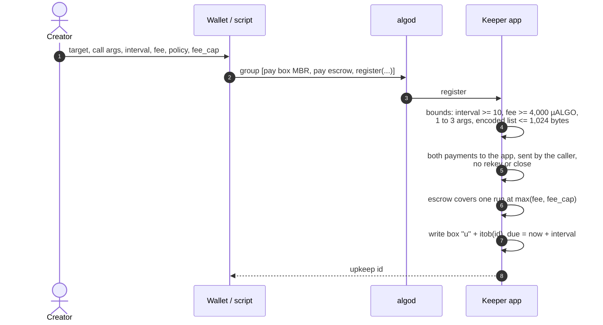

The two payments are the transactions immediately before the app call
(`gtxn` arguments in `register`). Binding both to `Txn.sender` is what stops a
group where a victim pays and an attacker becomes the upkeep's creator; the
reasoning is in the contract beside the asserts. The console builds this group
from [`js/src/keeper-txns.ts`](../js/src/keeper-txns.ts) and refuses to
register a call its own Test button has just shown would fail
([`status.md`](status.md), "The dogfood").

### 4.2 Execute

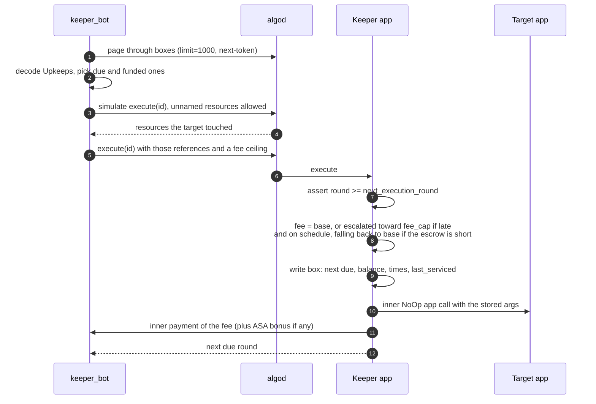

The box is written before the inner call, and everything is one transaction:
if the target reverts, nothing happens and nobody pays, because Algorand
rejects a failing transaction at validation rather than charging for it
(`scripts/keeper_e2e.py` proves this on a real node). Two keepers racing for
one upkeep therefore cost the loser nothing ([`status.md`](status.md) records
the first real race). The keeper pays the outer fee plus two inner transaction
fees (three with an ASA bonus), so an execution at the 4,000 µALGO floor nets a
keeper about 1,000 µALGO ([`arcron.md`](arcron.md) has the economics).

The bot keeps a cache of boxes and re-reads one only when a stale copy could
change a decision, then sleeps until the soonest round anything could need it
([`scripts/keeper_bot.py`](../scripts/keeper_bot.py), `Registry` and
`wait_for_work`). A target that keeps failing is backed off and retried later
([`scripts/keeper_backoff.py`](../scripts/keeper_backoff.py)). References
are discovered by simulating first because the default algokit populator stops
at four account references while the AVM allows six for the target
(`_resolve_execute_references`).

### 4.3 Top up and cancel

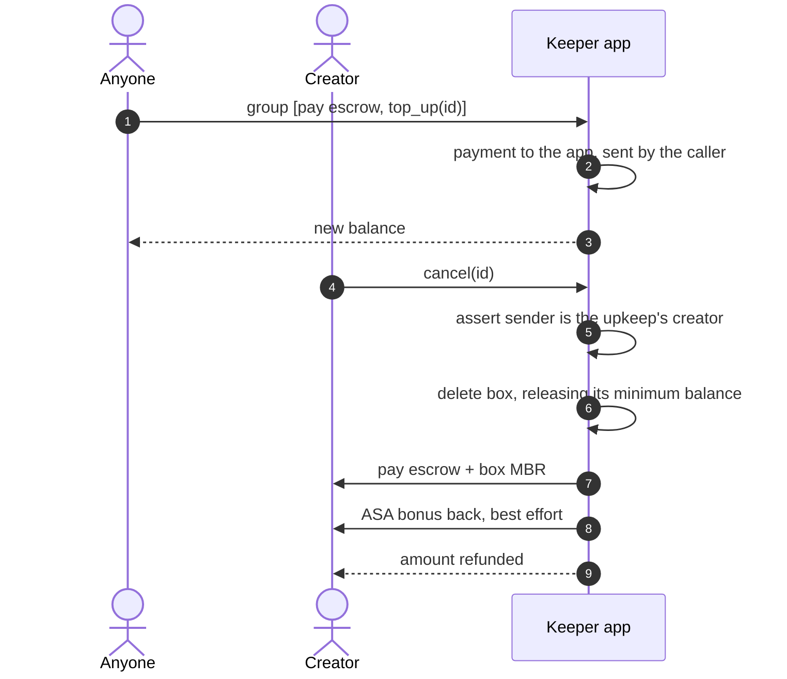

`top_up` is open to anyone, so somebody who cares about a schedule can pay for
it; `cancel` is creator-only, and the ALGO refund never depends on the ASA
transfer succeeding (a clawed-back or frozen asset only forfeits the bonus).

### 4.4 Watching: the notifier

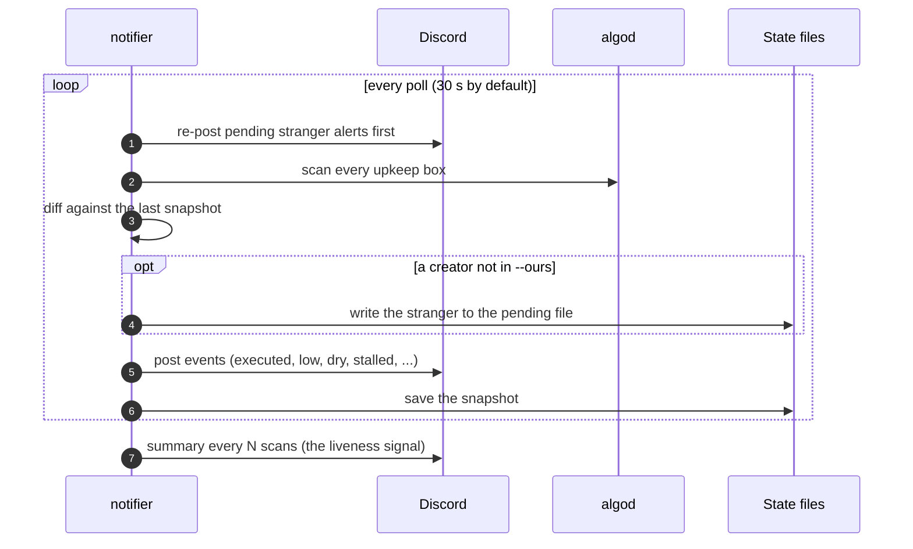

Events are edge-triggered: an upkeep is announced once when it registers,
executes, is cancelled, falls under a week of runway (`--low-runway-days`),
runs dry, revives or stalls. A **stranger**, an upkeep whose creator is not in
`--ours`, is written to disk before the snapshot advances and re-posted until
Discord returns a 2xx, so a failed delivery or a restart cannot lose it. On
MainNet the notifier refuses to start without `--ours`, or without a webhook
unless `--stdout` says announcements should go to the log instead. It holds
no key, and a test fails if anything key-shaped appears in it.

### 4.5 Governance and the MainNet create

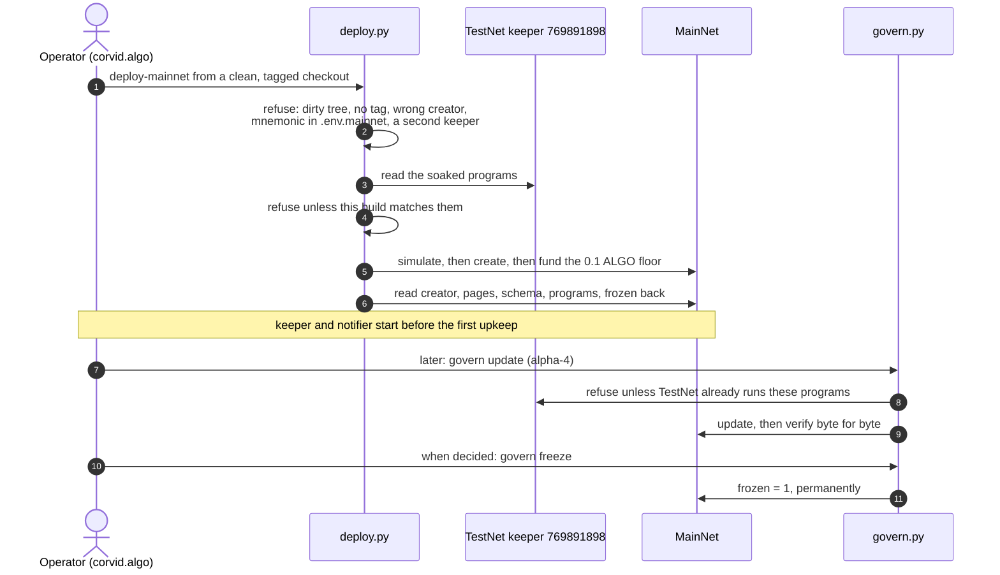

While `frozen` is 0 the creator can replace the programs, and so can reach
every escrow; that is the trade the design makes on purpose so a bug is a patch
rather than a migration ([`security.md`](security.md)). `freeze` sets a global
that nothing can reset. `update` changes code only: a new `Upkeep` struct,
global schema or page count still means a new app id
([`design/1.0.md`](design/1.0.md)). The create, `update`, `freeze` and the
ceremony's other shell signers pay the network minimum fee flat and refuse a
node advising more than 10,000 µALGO (`govern.bounded_params`, whose docstring
is the inventory); the keeper bot signs with its own fee ceiling. The full ceremony, its rehearsals and the stranger
policy are [`design/mainnet-rollout.md`](design/mainnet-rollout.md).

## 5. Data

### On-chain state

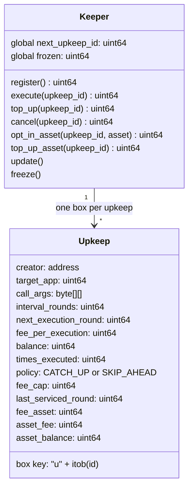

Global schema is two uints and no byte slices; local state is unused; the app
has one extra program page. All three are fixed at create. Box values are
ARC-4 head/tail encoded: a 130-byte head, then the argument list. The
reference decoder is `_decode_upkeep` in
[`scripts/keeper_bot.py`](../scripts/keeper_bot.py) and its TypeScript twin
is [`js/src/upkeep.ts`](../js/src/upkeep.ts); both are pinned to the same
recorded box. A box costs `BOX_MBR_FIXED + 400 × len(encoded call_args)` µALGO of
minimum balance, paid at `register` and returned by `cancel`. The contract's
book (the sum of box balances) must never exceed the app account's
spendable balance; a surplus is harmless and a shortfall is flagged.
`registry_health` and `preflight` check that solvency on every run.

### Upkeep lifecycle

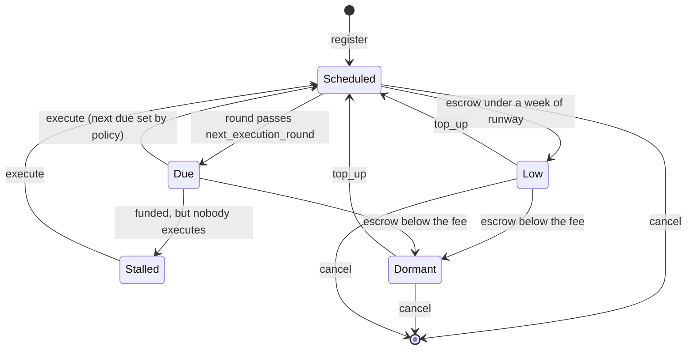

Only `Scheduled`, `Due` and the escrow are on chain; `Low`, `Dormant` and
`Stalled` are how the notifier and `health` describe an upkeep
([`scripts/notifier.py`](../scripts/notifier.py),
[`scripts/registry_health.py`](../scripts/registry_health.py)). A dormant
upkeep is not an error on chain: it waits, and runs again the moment somebody
tops it up. Under `CATCH_UP` a missed schedule is replayed one interval at a
time; under `SKIP_AHEAD` it jumps to the next future slot and keeps its phase.
The escalation rules and their reasons are in
[`design/scheduling-and-fees.md`](design/scheduling-and-fees.md) and
[`design/escalation.md`](design/escalation.md).

### Off-chain state

| State | Where | Owned by |
|---|---|---|
| Notifier snapshot and pending stranger alerts | JSON files beside each other (`--state-file`) | [`scripts/notifier.py`](../scripts/notifier.py) |
| Keeper backoff per failing upkeep | a JSON state file (`--state-file`, or none with `--no-state`) | [`scripts/keeper_backoff.py`](../scripts/keeper_backoff.py) |
| Network settings | `.env.<network>`, gitignored; templates are committed | [`scripts/network.py`](../scripts/network.py) |
| Release record per stage | [`releases.md`](releases.md), checked daily against the chain | [`scripts/verify_release.py`](../scripts/verify_release.py) |

There is no database. The chain is the source of truth, and every reader
derives its view from box reads.

## 6. Runtime and deployment

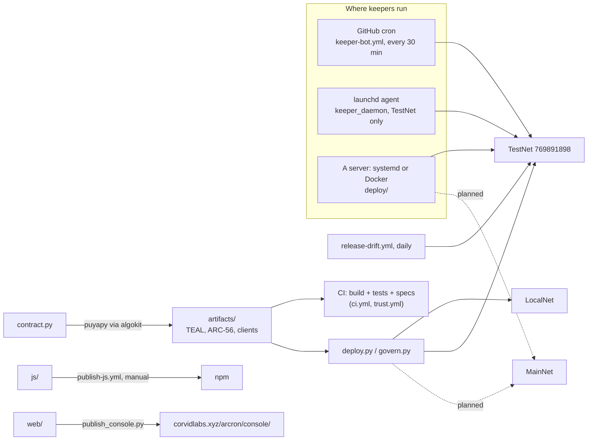

- **Build.** `poetry run python -m smart_contracts build` compiles every
  contract with Puya through AlgoKit and regenerates the typed clients. CI
  fails if the committed artifacts differ from a fresh build
  ([`.github/workflows/ci.yml`](../.github/workflows/ci.yml)).
- **Checks.** `ci.yml` runs "Contracts and console" on pushes to `main` and
  on pull requests, and the LocalNet end-to-end job on pushes to `main` and on
  manual dispatch. `trust.yml` runs the CorvidLabs Trust gate, whose lifecycle is
  `fledge lanes run verify` ([`.trust.toml`](../.trust.toml)). Locally,
  [`fledge.toml`](../fledge.toml) defines the `ci`, `local`, `endurance` and
  `verify` lanes.
- **Releases.** Stages and their gates are [`releases.md`](releases.md);
  `release-drift.yml` compares the live deployment with that record daily. The
  SDK is published to npm by hand-dispatching `publish-js.yml`.
- **Console.** Built with Angular and staged into the CorvidLabs site by
  `scripts/publish_console.py`, at the one canonical address above
  ([`hosting.md`](hosting.md) and [`console-plan.md`](console-plan.md)). The
  console knows LocalNet and TestNet only ([`js/src/networks.ts`](../js/src/networks.ts));
  a MainNet entry is deliberately withheld until freeze.
- **Keepers.** A keeper is any process that calls `execute`. The repository
  ships three ways to run one: the GitHub cron (a stopgap, which delivers only
  a fraction of its schedule), a launchd agent for a developer machine, and a
  server install with systemd units or Docker Compose plus an optional algod
  node of our own ([`deploy/`](../deploy/), [`hosting.md`](hosting.md)).
  `keeper_daemon` refuses MainNet: MainNet is a server.
- **Unknown:** which host runs the MainNet keeper and notifier is operational
  detail kept out of this public repository on purpose.

### The road to MainNet

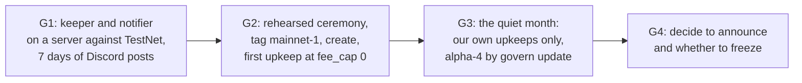

The gates, their evidence and what is still open are recorded in
[`design/mainnet-rollout.md`](design/mainnet-rollout.md).

## 7. Security and trust boundaries

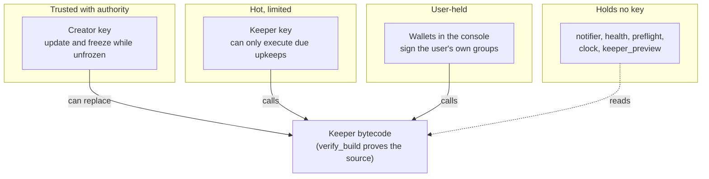

- **What the contract enforces.** Every payment it accepts is bound to the
  caller and refuses rekey and close; only an upkeep's creator can cancel it;
  only the app's creator can `update` or `freeze`, and not after `freeze`. A
  run pays `fee_per_execution`, or, when `fee_cap` is set, at most `fee_cap`
  (a `fee_cap` of 0 means no escalation, not a fee of 0), and never more than
  the upkeep's own escrow. A target cannot
  re-enter `execute`, because the AVM refuses an inner call to an app already
  on the call stack.
- **What the contract cannot give a target.** Registration is open, so a
  target that trusts "the caller is the Keeper app" has trusted anyone willing
  to register. A target must be safe to call by anyone, at any time after the
  interval ([`integrating.md`](integrating.md), authorization section).
- **Keys.** The creator key is exported into the shell for a ceremony and never
  written to a file: every MainNet script refuses a `.env.mainnet` carrying a
  `DEPLOYER_MNEMONIC` line ([`scripts/network.py`](../scripts/network.py)). The keeper bot
  refuses to sign as the creator of an unfrozen app or as the MainNet creator,
  whatever the key was called. Reaching MainNet at all needs
  `ARCRON_ALLOW_MAINNET=1`. `.env.*` files are gitignored.
- **Soak.** A MainNet create or update must be bytecode the TestNet keeper is
  already running; both refuse otherwise and fail closed if TestNet cannot be
  read ([`scripts/deploy.py`](../scripts/deploy.py),
  [`scripts/govern.py`](../scripts/govern.py)).
- **The console's address is a security property.** The contract is
  permissionless, so anybody can host a front end; the canonical address is the
  only thing separating ours from a copy asking for a signature
  ([`security.md`](security.md)).
- **Review record.** Five adversarial review rounds, none of them a paid audit;
  every finding and its status is in [`reviews/findings.md`](reviews/findings.md).
  The threat model and accepted risks are [`security.md`](security.md) and
  [`SECURITY.md`](../SECURITY.md).

## 8. Failure modes and limits

| What happens | What it does | Where |
|---|---|---|
| Escrow falls below the fee | The upkeep goes dormant; no keeper can run it until a top-up. The notifier says so a week before and again when it happens | contract `execute`, [`scripts/notifier.py`](../scripts/notifier.py) |
| The target reverts | The whole execution is rejected; no fee is charged, no state changes; the bot backs off | [`scripts/keeper_backoff.py`](../scripts/keeper_backoff.py) |
| Nobody executes a funded, due upkeep | Reported as stalled; with `fee_cap` above the fee, the price rises over one missed interval to attract a keeper | [`design/escalation.md`](design/escalation.md) |
| Two keepers race | One wins; the loser's transaction never reaches a block and costs nothing | [`status.md`](status.md) |
| A target needs more references | Up to six references for the target are reachable (two are Arcron's own); a seventh is refused | `scripts/reference_boundary.py`, [`arcron.md`](arcron.md) |
| The public node refuses or rate-limits | Requests retry and alternate to `ALGOD_SERVER_FALLBACK`; a node that cannot page boxes is refused loudly | [`scripts/node_retry.py`](../scripts/node_retry.py), [`scripts/keeper_bot.py`](../scripts/keeper_bot.py) |
| A box is cancelled mid-scan | Skipped; the scan carries on | [`scripts/keeper_bot.py`](../scripts/keeper_bot.py) |
| The notifier dies | No summary arrives; the runbook treats a missing summary as a dead watcher within 24 hours | [`design/mainnet-rollout.md`](design/mainnet-rollout.md) |
| A bug is found before freeze | Fixed by `govern update`, TestNet first | [`security.md`](security.md) |
| A bug needs a new struct, schema or page | A new app id, and every creator cancels and re-registers | [`design/1.0.md`](design/1.0.md) |

Hard limits, all in the contract: interval at least 10 rounds, fee at least
4,000 µALGO, at most three app arguments counting the selector, an encoded
argument list of at most 1,024 bytes, NoOp calls only. An upkeep can be registered against a
method its target does not have; nothing on chain rejects it, and it will
never run ([`status.md`](status.md) tells that story).

## 9. Decisions

- [`design/1.0.md`](design/1.0.md): the 1.0 scope, and why a struct change means
  a new app id.
- [`design/out-of-scope.md`](design/out-of-scope.md): staking and
  keeper-supplied data are closed, and why.
- [`design/call-shapes.md`](design/call-shapes.md): up to three app arguments.
- [`design/scheduling-and-fees.md`](design/scheduling-and-fees.md) and
  [`design/escalation.md`](design/escalation.md): catch-up policies and the fee
  ramp.
- [`design/asa-fees.md`](design/asa-fees.md): an ASA bonus as a capability on
  top of the ALGO fee, not a replacement.
- [`design/split.md`](design/split.md): why rain moved to its own repository.
- [`design/mainnet-rollout.md`](design/mainnet-rollout.md): the quiet MainNet
  rollout, unfrozen, own upkeeps only, watched by the notifier.
- [`specs/`](../specs/): one strict SpecSync spec per contract.
- [`INTENT.md`](../INTENT.md) and [`hi/`](../hi/): what the product should
  be, as permanent criteria.

## 10. Glossary

| Term | Meaning |
|---|---|
| Upkeep | One registered schedule: a target, its call, an interval, a fee, and escrow, stored in one box |
| Keeper | Any account that calls `execute` on a due upkeep and is paid for it |
| Target | The app an upkeep calls |
| Escrow | The ALGO an upkeep holds in the Keeper app to pay for its runs |
| Box MBR | The minimum balance a box locks; paid at `register`, returned at `cancel` |
| `CATCH_UP` / `SKIP_AHEAD` | Whether missed runs are replayed or skipped |
| `fee_cap` | The most one run may pay when the upkeep is late; 0 disables escalation |
| Runway | How long an upkeep's escrow lasts at its cadence |
| Dormant, stalled, low | Watcher states: cannot pay; funded and nobody came; under a week of runway |
| Frozen | The creator has given up `update` for good |
| Soak | Time the exact bytecode has run on TestNet before it may reach MainNet |
| Stranger | On MainNet, an upkeep whose creator is not one of ours |

## Related documents

| Document | What it is |
|---|---|
| [`arcron.md`](arcron.md) | Hand-off reference: API, box encoding, economics, operations |
| [`integrating.md`](integrating.md) | Pointing Arcron at a contract you wrote |
| [`first-upkeep.md`](first-upkeep.md) | Registering a first upkeep through the console |
| [`journeys.md`](journeys.md) | What the console has to let people do: the journeys its requirements were argued from |
| [`security.md`](security.md) | Threat model, accepted risks, what happens if a bug is found |
| [`hosting.md`](hosting.md) | Where to run a keeper, and how to watch it |
| [`deploying.md`](deploying.md) | Deploying, updating and freezing a deployment, on any network |
| [`releases.md`](releases.md) | Release stages and the record per stage |
| [`status.md`](status.md) | What exists and what state it is in |
| [`testnet.md`](testnet.md) | The TestNet deployment record |
| [`why.md`](why.md) | The case for the primitive, and what would falsify it |
| [`prior-art.md`](prior-art.md) | What came before on Algorand and elsewhere |
| [`console-plan.md`](console-plan.md) | How the console was planned |
| [`review-brief.md`](review-brief.md) | The brief given to adversarial reviewers |
| [`reviews/`](reviews/) | The reviews, unedited, and the findings index |
| [`ac/`](ac/) | Acceptance criteria for those journeys (J1 to J5) |
| [`book/`](book/) | The Working Guide: all of `docs/` in one ordered read |
| [`design/`](design/) | The design decisions listed above |
